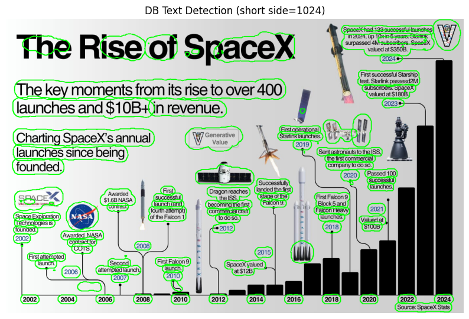

# DBNet for Text Recognition

## Performance
- **Validation Loss**: 0.1557 on Synth Validation set
- **Dataset**: Trained on SynthText

## Example Inference

<table>
  <tr>
    <td></td>
    <td></td>
  </tr>
</table>

## Usage

### Setup and Training
1. **Clone the repo and add to sys path**:
   ```bash
   git clone https://github.com/seungjun-green/DBNet.git
   ```

   Then, in Python:
   ```python
   import sys
   sys.path.append("/path/to/DBNet")  # e.g., "/content/DBNet" for Colab
   ```
   
2. **Install dependencies:**
    ```bash
    pip install -r requirements.txt
    ```

3. **Create a Trainer object:**

```python

from scripts.train import Trainer

trainer = Trainer(
    backbone='resnet50',
    batch_size=16,
    val_split=0.015,
    epoch_num=2,
    max_confidence=5,
    log_per_epoch=7,
    mat_file="/path/to/SynthText/gt.mat",
    images_dir="/path/to/SynthText/",
    device='cuda'
)
```

4. **Train!**
```python
trainer.train()
```